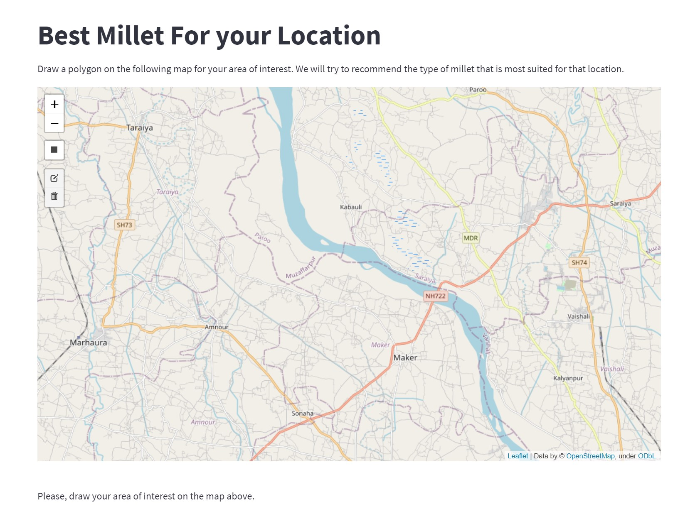
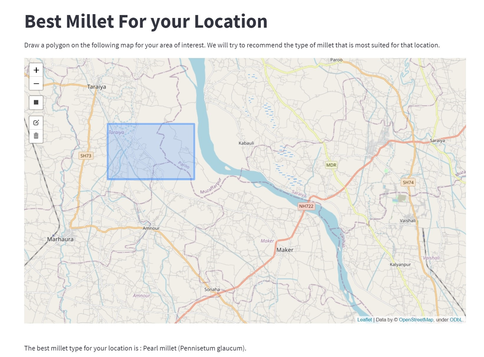

# task-4-dashboard

### Task Overview:
This task involves developing the user facing dashboard for where users can visit and try out the recommendation engine

###
The dashboard has an interactive map, on which a user can draw a polygon. When the user draws a polygon, the model is called to 
make prediction for that particular location and the best type of millet recommended by the model for that area is shown to the user.

### Asking User to provide the area of interest

<figure>

<figcaption>Fig.1 : Dashboard for asking user input</figcaption>
</figure>    

### Showing the recommended millet type to the user

<figure>

<figcaption>Fig.1 : Dashboard displaying the recommendation result</figcaption>
</figure>    

